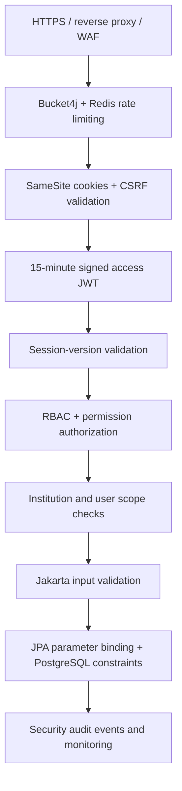

# Security Policy

## Reporting a vulnerability

Do not disclose suspected vulnerabilities in a public issue. Contact the repository
owner privately with a description, reproduction steps, affected endpoints, and
potential impact.

## Deployment guidance

- Replace all localhost credentials and JWT defaults.
- Store secrets outside source control.
- Use HTTPS.
- Use a restricted PostgreSQL account.
- Replace automatic schema updates with versioned migrations.
- Review CORS origins and token expiration for the deployment environment.
- Rotate secrets immediately if exposure is suspected.

## Implemented defense-in-depth layers

- Tokens are held in HttpOnly cookies and never browser storage or response JSON.
- Refresh tokens are random, stored only as SHA-256 hashes, rotated on use, and revoked on logout.
- Reuse of a rotated refresh token is treated as compromise and revokes every user session.
- A per-user session version immediately invalidates previously issued access JWTs after logout or compromise.
- Five failed password attempts lock an account for 15 minutes; IP throttling applies before authentication.
- Authentication events record user, institution, result, IP, user agent, event type, and timestamp.
- New managed-account passwords require 12–100 characters with upper/lowercase, digit, and special character.
- Credentialed CORS uses exact configured origins; CSRF is required for authenticated state changes.
- CSP, clickjacking prevention, MIME sniffing prevention, generic errors, and request validation are enabled.

## Required infrastructure controls

Application controls are only one part of security. Production must also use:

- A managed WAF/load balancer with DDoS protection, TLS 1.2+, HSTS, and request-size limits.
- A secret manager and automated key rotation; never commit production secrets or `.env` files.
- Private PostgreSQL and Redis networks, TLS connections, least-privilege accounts, backups, and restore tests.
- Versioned Flyway/Liquibase migrations with `JPA_DDL_AUTO=validate`.
- Centralized immutable audit logs, alerting for lockouts/reuse/401/403/429 spikes, and an incident runbook.
- Dependency, container, SAST, DAST, and secret scanning in CI, with timely security patching.
- MFA for privileged roles, short administrator sessions, periodic access reviews, and offboarding automation.
- Encrypted backups, data-retention policies, tenant-isolation tests, and regular penetration tests.

## Remaining recommended roadmap

Before an internet-facing production launch, add WebAuthn/TOTP MFA for Super Admin and Principal,
managed key rotation with JWT `kid`, device/session management, breached-password screening,
email alerts for suspicious sign-ins, and an independent penetration test. No system should be
described as unhackable; security depends on continuous monitoring, patching, and response.
