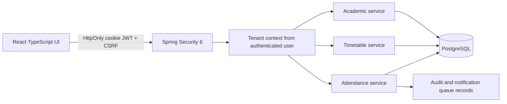
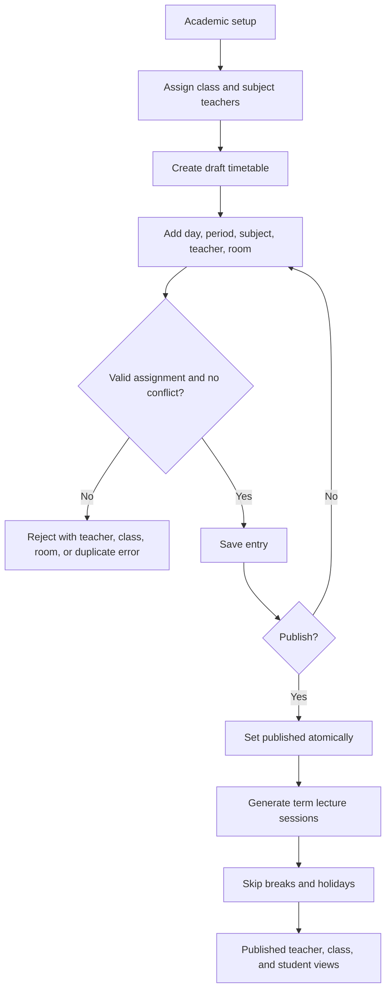
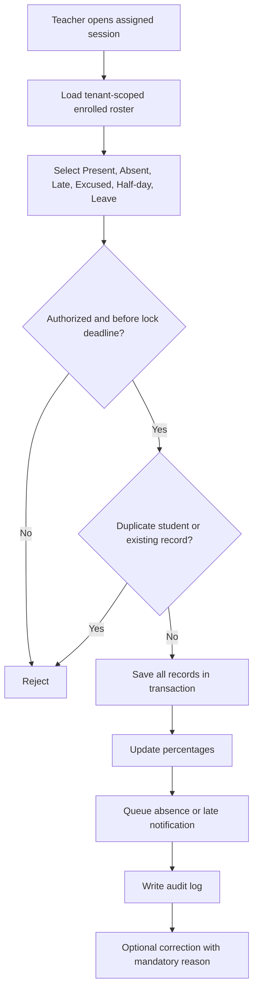
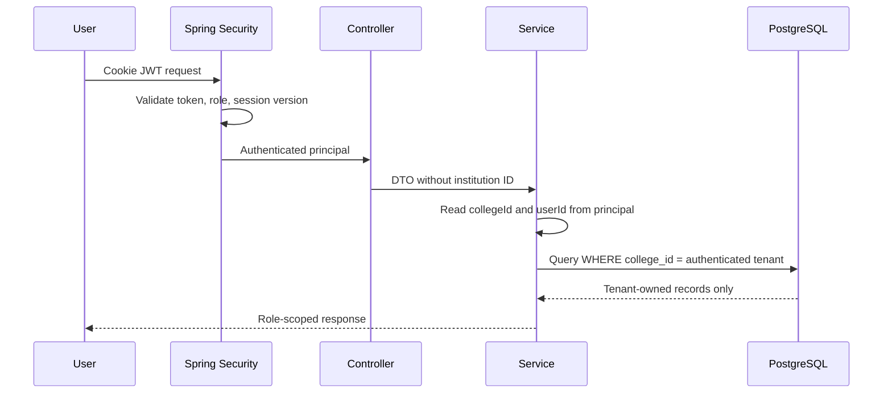
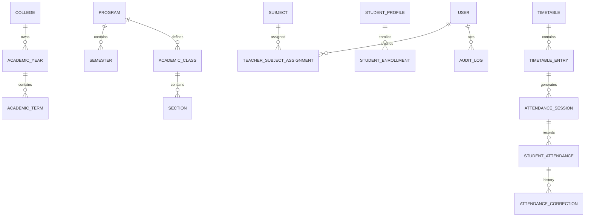

# Architecture and Flowcharts

## Architecture

```mermaid
flowchart LR
  UI[React TypeScript UI] -->|HttpOnly cookie JWT + CSRF| API[Spring Security 6]
  API --> TENANT[Tenant context from authenticated user]
  TENANT --> AC[Academic service]
  TENANT --> TT[Timetable service]
  TENANT --> AT[Attendance service]
  AC --> DB[(PostgreSQL)]
  TT --> DB
  AT --> DB
  AT --> AUDIT[Audit and notification queue records]
```

## Timetable lifecycle

```mermaid
flowchart TD
  A[Academic setup] --> B[Assign class and subject teachers]
  B --> C[Create draft timetable]
  C --> D[Add day, period, subject, teacher, room]
  D --> E{Valid assignment and no conflict?}
  E -->|No| F[Reject with teacher, class, room, or duplicate error]
  E -->|Yes| G[Save entry]
  G --> H{Publish?}
  H -->|No| D
  H -->|Yes| I[Set published atomically]
  I --> J[Generate term lecture sessions]
  J --> K[Skip breaks and holidays]
  K --> L[Published teacher, class, and student views]
```

## Manual attendance

```mermaid
flowchart TD
  A[Teacher opens assigned session] --> B[Load tenant-scoped enrolled roster]
  B --> C[Select Present, Absent, Late, Excused, Half-day, Leave]
  C --> D{Authorized and before lock deadline?}
  D -->|No| E[Reject]
  D -->|Yes| F{Duplicate student or existing record?}
  F -->|Yes| E
  F -->|No| G[Save all records in transaction]
  G --> H[Update percentages]
  H --> I[Queue absence or late notification]
  I --> J[Write audit log]
  J --> K[Optional correction with mandatory reason]
```

## Tenant and authorization boundary

```mermaid
sequenceDiagram
  participant U as User
  participant S as Spring Security
  participant C as Controller
  participant V as Service
  participant D as PostgreSQL
  U->>S: Cookie JWT request
  S->>S: Validate token, role, session version
  S->>C: Authenticated principal
  C->>V: DTO without institution ID
  V->>V: Read collegeId and userId from principal
  V->>D: Query WHERE college_id = authenticated tenant
  D-->>V: Tenant-owned records only
  V-->>U: Role-scoped response
```

## Database relationships

```mermaid
erDiagram
  COLLEGE ||--o{ ACADEMIC_YEAR : owns
  ACADEMIC_YEAR ||--o{ ACADEMIC_TERM : contains
  PROGRAM ||--o{ SEMESTER : contains
  PROGRAM ||--o{ ACADEMIC_CLASS : defines
  ACADEMIC_CLASS ||--o{ SECTION : contains
  SUBJECT ||--o{ TEACHER_SUBJECT_ASSIGNMENT : assigned
  USER ||--o{ TEACHER_SUBJECT_ASSIGNMENT : teaches
  STUDENT_PROFILE ||--o{ STUDENT_ENROLLMENT : enrolled
  TIMETABLE ||--o{ TIMETABLE_ENTRY : contains
  TIMETABLE_ENTRY ||--o{ ATTENDANCE_SESSION : generates
  ATTENDANCE_SESSION ||--o{ STUDENT_ATTENDANCE : records
  STUDENT_ATTENDANCE ||--o{ ATTENDANCE_CORRECTION : history
  USER ||--o{ AUDIT_LOG : acts
```
