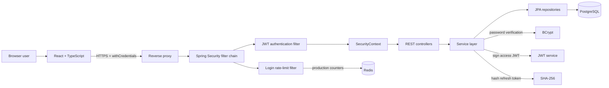
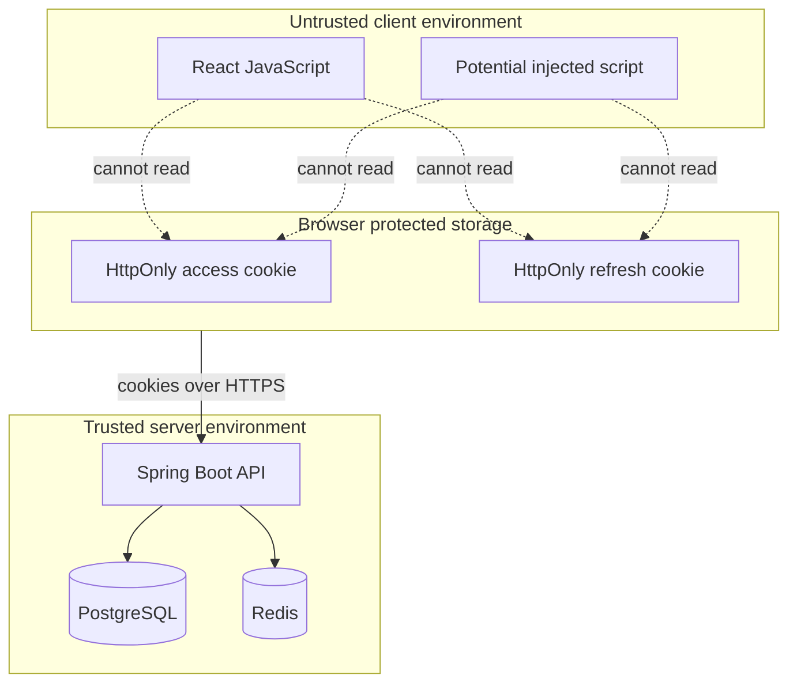

# System Architecture

```mermaid
flowchart LR
    U[Browser user] --> R[React + TypeScript]
    R -->|HTTPS + withCredentials| P[Reverse proxy]
    P --> S[Spring Security filter chain]
    S --> RL[Login rate-limit filter]
    S --> JF[JWT authentication filter]
    JF --> SC[SecurityContext]
    SC --> C[REST controllers]
    C --> SV[Service layer]
    SV --> RP[JPA repositories]
    RP --> PG[(PostgreSQL)]
    RL -->|production counters| RD[(Redis)]
    SV -->|password verification| BC[BCrypt]
    SV -->|sign access JWT| JU[JWT service]
    SV -->|hash refresh token| SHA[SHA-256]
```

## Trust boundaries

```mermaid
flowchart TB
    subgraph Untrusted[Untrusted client environment]
        JS[React JavaScript]
        XSS[Potential injected script]
    end
    subgraph Browser[Browser protected storage]
        AC[HttpOnly access cookie]
        RC[HttpOnly refresh cookie]
    end
    subgraph Trusted[Trusted server environment]
        API[Spring Boot API]
        DB[(PostgreSQL)]
        REDIS[(Redis)]
    end
    JS -. cannot read .-> AC
    JS -. cannot read .-> RC
    XSS -. cannot read .-> AC
    XSS -. cannot read .-> RC
    Browser -->|cookies over HTTPS| API
    API --> DB
    API --> REDIS
```
