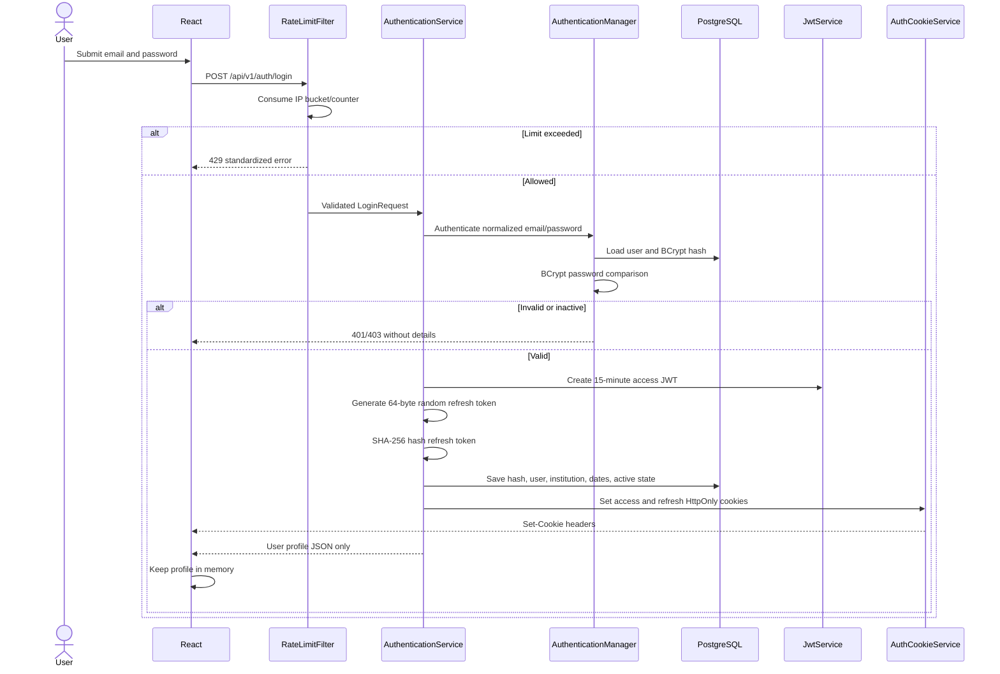

# Login Flow

Endpoint: `POST /api/v1/auth/login`

```mermaid
sequenceDiagram
    actor User
    participant React
    participant Rate as RateLimitFilter
    participant Auth as AuthenticationService
    participant Security as AuthenticationManager
    participant DB as PostgreSQL
    participant JWT as JwtService
    participant Cookie as AuthCookieService

    User->>React: Submit email and password
    React->>Rate: POST /api/v1/auth/login
    Rate->>Rate: Consume IP bucket/counter
    alt Limit exceeded
        Rate-->>React: 429 standardized error
    else Allowed
        Rate->>Auth: Validated LoginRequest
        Auth->>Security: Authenticate normalized email/password
        Security->>DB: Load user and BCrypt hash
        Security->>Security: BCrypt password comparison
        alt Invalid or inactive
            Security-->>React: 401/403 without details
        else Valid
            Auth->>JWT: Create 15-minute access JWT
            Auth->>Auth: Generate 64-byte random refresh token
            Auth->>Auth: SHA-256 hash refresh token
            Auth->>DB: Save hash, user, institution, dates, active state
            Auth->>Cookie: Set access and refresh HttpOnly cookies
            Cookie-->>React: Set-Cookie headers
            Auth-->>React: User profile JSON only
            React->>React: Keep profile in memory
        end
    end
```

The JSON response contains `id`, profile fields, roles, and `institutionId`. It never contains either token.
