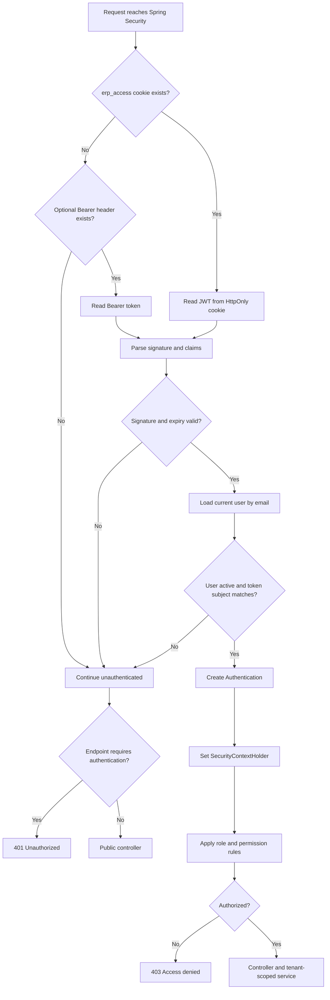

# Protected Request Flow

```mermaid
flowchart TD
    A[Request reaches Spring Security] --> B{erp_access cookie exists?}
    B -- No --> C{Optional Bearer header exists?}
    C -- No --> U[Continue unauthenticated]
    C -- Yes --> D[Read Bearer token]
    B -- Yes --> E[Read JWT from HttpOnly cookie]
    D --> F[Parse signature and claims]
    E --> F
    F --> G{Signature and expiry valid?}
    G -- No --> U
    G -- Yes --> H[Load current user by email]
    H --> I{User active and token subject matches?}
    I -- No --> U
    I -- Yes --> J[Create Authentication]
    J --> K[Set SecurityContextHolder]
    U --> L{Endpoint requires authentication?}
    K --> M[Apply role and permission rules]
    L -- Yes --> N[401 Unauthorized]
    L -- No --> O[Public controller]
    M --> P{Authorized?}
    P -- No --> Q[403 Access denied]
    P -- Yes --> R[Controller and tenant-scoped service]
```

Invalid access cookies do not block the public refresh endpoint. They continue as unauthenticated requests so refresh rotation can run.
