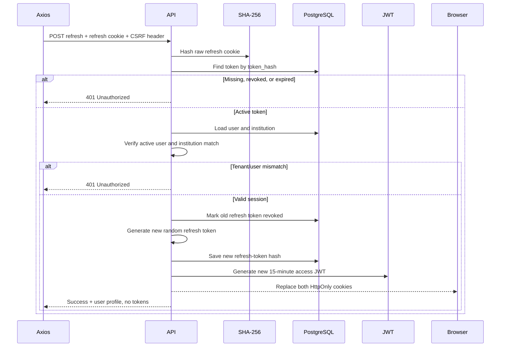
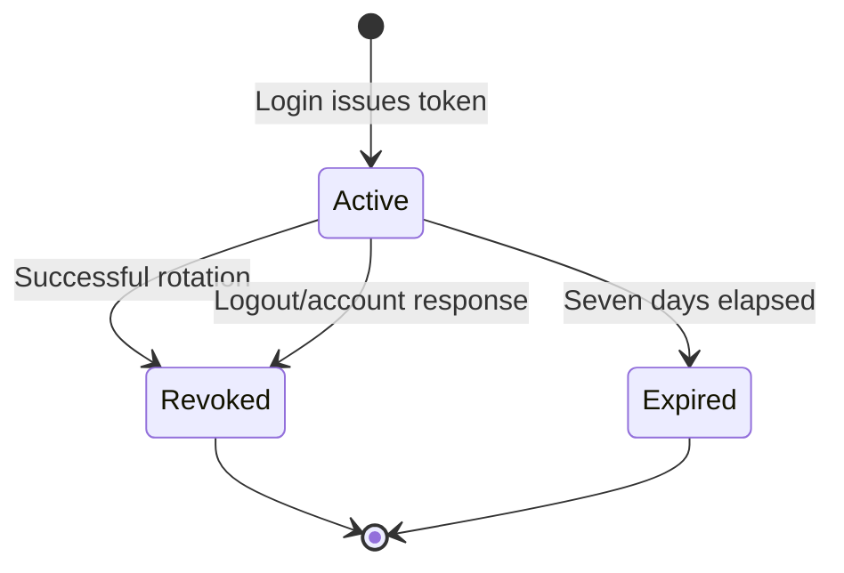

# Refresh and Rotation Flow

Endpoint: `POST /api/v1/auth/refresh`

```mermaid
sequenceDiagram
    participant Axios
    participant API
    participant Hash as SHA-256
    participant DB as PostgreSQL
    participant JWT
    participant Browser

    Axios->>API: POST refresh + refresh cookie + CSRF header
    API->>Hash: Hash raw refresh cookie
    API->>DB: Find token by token_hash
    alt Missing, revoked, or expired
        API-->>Axios: 401 Unauthorized
    else Active token
        API->>DB: Load user and institution
        API->>API: Verify active user and institution match
        alt Tenant/user mismatch
            API-->>Axios: 401 Unauthorized
        else Valid session
            API->>DB: Mark old refresh token revoked
            API->>API: Generate new random refresh token
            API->>DB: Save new refresh-token hash
            API->>JWT: Generate new 15-minute access JWT
            API-->>Browser: Replace both HttpOnly cookies
            API-->>Axios: Success + user profile, no tokens
        end
    end
```

```mermaid
stateDiagram-v2
    [*] --> Active: Login issues token
    Active --> Revoked: Successful rotation
    Active --> Expired: Seven days elapsed
    Active --> Revoked: Logout/account response
    Revoked --> [*]
    Expired --> [*]
```
