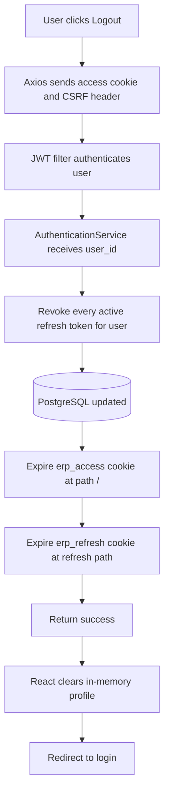

# Logout Flow

Endpoint: `POST /api/v1/auth/logout`

```mermaid
flowchart TD
    A[User clicks Logout] --> B[Axios sends access cookie and CSRF header]
    B --> C[JWT filter authenticates user]
    C --> D[AuthenticationService receives user_id]
    D --> E[Revoke every active refresh token for user]
    E --> F[(PostgreSQL updated)]
    F --> G[Expire erp_access cookie at path /]
    G --> H[Expire erp_refresh cookie at refresh path]
    H --> I[Return success]
    I --> J[React clears in-memory profile]
    J --> K[Redirect to login]
```

Logout revokes the user’s active refresh chain even though the narrowly scoped refresh cookie is not sent to the logout path.
