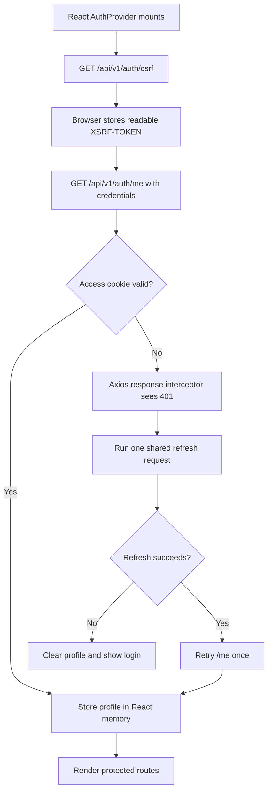
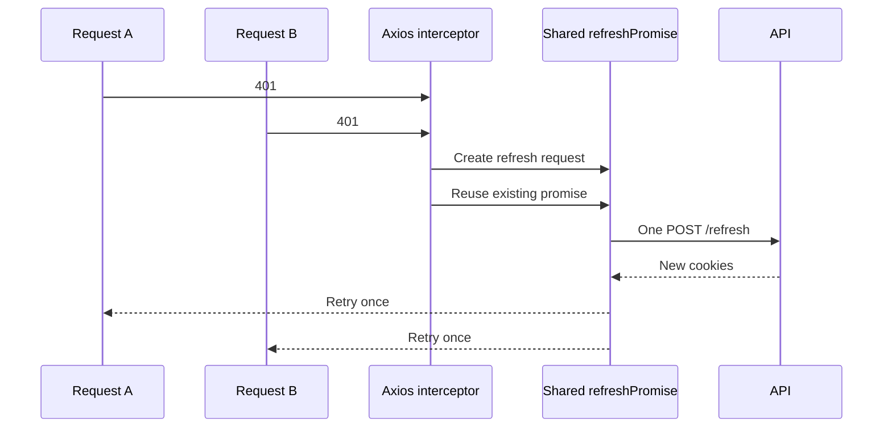

# Frontend Session and Axios Flow

## Application startup

```mermaid
flowchart TD
    A[React AuthProvider mounts] --> B[GET /api/v1/auth/csrf]
    B --> C[Browser stores readable XSRF-TOKEN]
    C --> D[GET /api/v1/auth/me with credentials]
    D --> E{Access cookie valid?}
    E -- Yes --> F[Store profile in React memory]
    E -- No --> G[Axios response interceptor sees 401]
    G --> H[Run one shared refresh request]
    H --> I{Refresh succeeds?}
    I -- Yes --> J[Retry /me once]
    J --> F
    I -- No --> K[Clear profile and show login]
    F --> L[Render protected routes]
```

## Concurrent 401 handling

```mermaid
sequenceDiagram
    participant A as Request A
    participant B as Request B
    participant I as Axios interceptor
    participant R as Shared refreshPromise
    participant API
    A->>I: 401
    B->>I: 401
    I->>R: Create refresh request
    I->>R: Reuse existing promise
    R->>API: One POST /refresh
    API-->>R: New cookies
    R-->>A: Retry once
    R-->>B: Retry once
```

The `_retried` flag prevents infinite retry loops.
