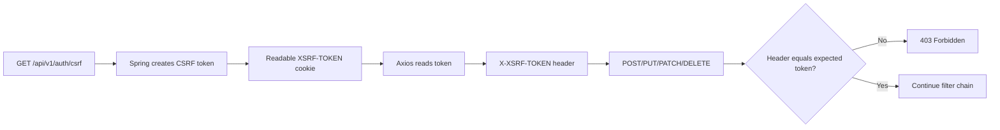
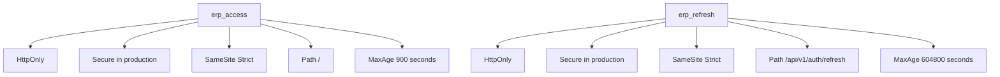

# CSRF and Cookie Flow

```mermaid
flowchart LR
    A[GET /api/v1/auth/csrf] --> B[Spring creates CSRF token]
    B --> C[Readable XSRF-TOKEN cookie]
    C --> D[Axios reads token]
    D --> E[X-XSRF-TOKEN header]
    E --> F[POST/PUT/PATCH/DELETE]
    F --> G{Header equals expected token?}
    G -- No --> H[403 Forbidden]
    G -- Yes --> I[Continue filter chain]
```

## Cookie attributes

```mermaid
flowchart TB
    AC[erp_access] --> A1[HttpOnly]
    AC --> A2[Secure in production]
    AC --> A3[SameSite Strict]
    AC --> A4[Path /]
    AC --> A5[MaxAge 900 seconds]
    RC[erp_refresh] --> R1[HttpOnly]
    RC --> R2[Secure in production]
    RC --> R3[SameSite Strict]
    RC --> R4[Path /api/v1/auth/refresh]
    RC --> R5[MaxAge 604800 seconds]
```

Login and public admission submission are CSRF-exempt. Authenticated mutations, refresh, and logout require the CSRF header.
