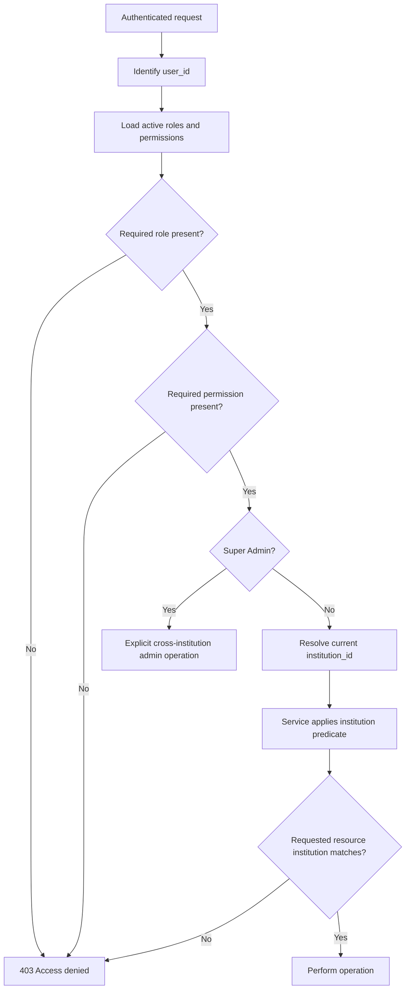
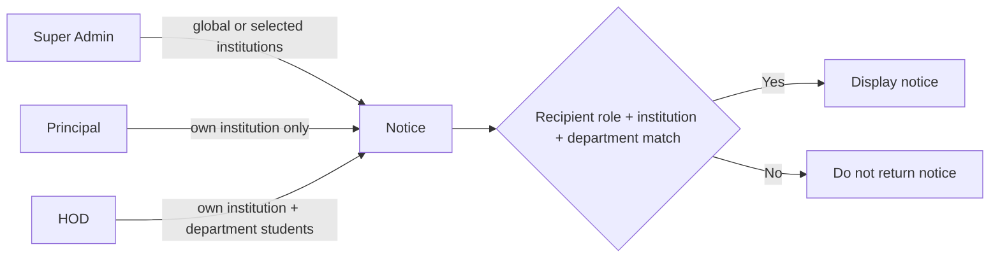

# Authorization and Tenant Isolation

The existing `college_id` is exposed as `institutionId` and embedded in JWTs as `institution_id`.

## Notice example

Repository queries and service checks must always include the tenant predicate; frontend filtering is never a security boundary.
