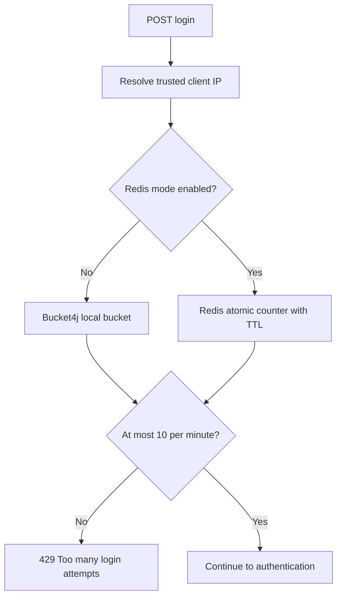
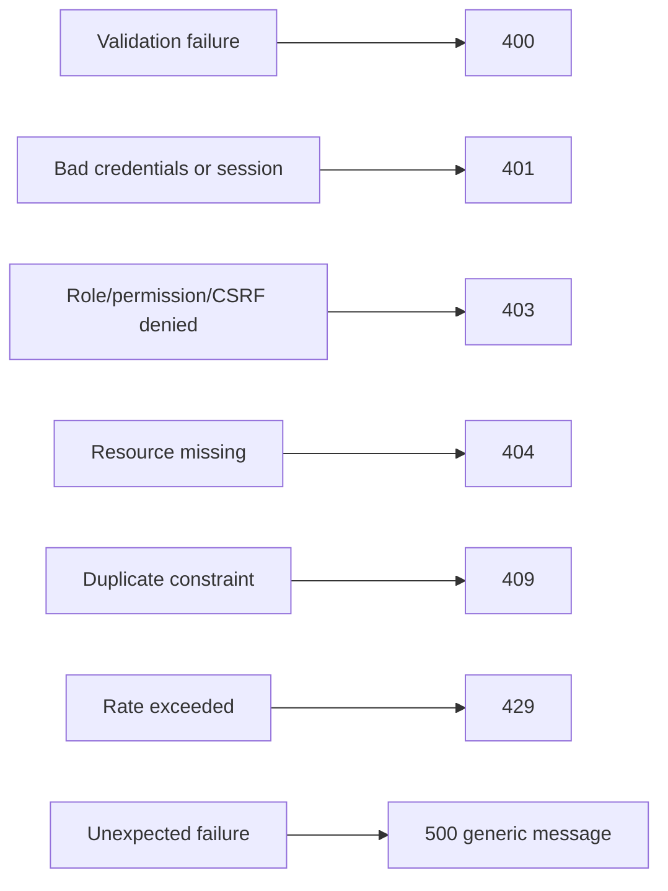

# Rate Limiting and Error Handling

## Login throttling



## Error response

```json
{
  "success": false,
  "message": "Unauthorized",
  "timestamp": "2026-07-14T11:03:28.846216",
  "errors": null,
  "path": "/api/v1/auth/login"
}
```



Stack traces and internal SQL/security details are never returned to clients.
