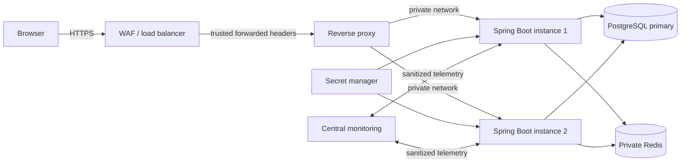
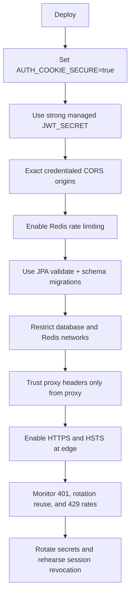

# Production Deployment Flow

## Deployment checklist

Required production values include `AUTH_COOKIE_SECURE=true`, `RATE_LIMIT_REDIS_ENABLED=true`, exact `CORS_ALLOWED_ORIGINS`, `JPA_DDL_AUTO=validate`, and a secret-manager supplied `JWT_SECRET`.
